# CultivaX — User Manual

**Version**: 3.0 · **Date**: April 2026 · **B.Tech 4th Semester Project**

---

# PART 1 — QUICK REFERENCE GUIDE

This section is a condensed overview of the CultivaX platform designed for evaluators to understand the platform quickly before diving deep.

---

## 1.1 What is CultivaX?

CultivaX is an event-driven, multi-tenant agricultural management platform with three core subsystems:

| Abbreviation | Full Name | Purpose |
|---|---|---|
| **CTIS** | Crop Timeline Integration System | Event-sourced crop lifecycle management with action replay, stress scoring, and biological risk assessment |
| **SOE** | Service Orchestration Engine | Equipment rental marketplace connecting farmers with service providers (booking, fulfillment, reviews) |
| **IAM** | Identity & Access Management | RBAC with OTP login, session tracking, brute-force protection, anomaly detection |

The platform is built with **FastAPI** (Python 3.11), **PostgreSQL 15**, **Next.js 14**, internationalized in 5 languages (English, Hindi, Tamil, Telugu, Marathi), and shipped as a **Progressive Web App (PWA)** with full offline sync.

---

## 1.2 System Architecture Diagram

```mermaid
graph TB
    subgraph Frontend ["Frontend (Next.js 14 PWA)"]
        LP[Login Page]
        FD[Farmer Dashboard]
        PD[Provider Dashboard]
        AD[Admin Dashboard]
        SW[Service Worker / Offline Queue]
    end

    subgraph API ["API Gateway (FastAPI)"]
        AUTH["/api/v1/auth"]
        CROPS["/api/v1/crops"]
        ACTIONS["/api/v1/crops/{id}/actions"]
        SIM["/api/v1/crops/{id}/simulate"]
        YIELD["/api/v1/crops/{id}/yield"]
        SR["/api/v1/service-requests"]
        PROV["/api/v1/providers"]
        ADMIN["/api/v1/admin"]
        MSG["/api/v1/messages"]
        SYNC["/api/v1/offline-sync"]
        ALERTS["/api/v1/alerts"]
        WEATHER["/api/v1/weather"]
        SCHEMES["/api/v1/schemes"]
        ML_API["/api/v1/ml"]
        RULES["/api/v1/rules"]
        REVIEWS["/api/v1/reviews"]
        ANALYTICS["/api/v1/analytics"]
        SEARCH["/api/v1/search"]
    end

    subgraph Services ["Core Services"]
        CS[CropService]
        AS[ActionService]
        RE[ReplayEngine]
        SE[StressEngine]
        WIE[WhatIfEngine]
        RS[RequestService]
        FS[FeedbackAggregator]
        RP[RiskPredictor]
    end

    subgraph EventBus ["Event System"]
        ED[EventDispatcher]
        DLQ[Dead Letter Queue]
        EL[EventLog Table]
    end

    subgraph DB ["PostgreSQL 15"]
        USERS[(users)]
        CI[(crop_instances)]
        AL[(action_logs)]
        SRQ[(service_requests)]
        EV[(event_log)]
        MSGS[(messages)]
        SNAP[(snapshots)]
    end

    LP --> AUTH
    FD --> CROPS
    FD --> ACTIONS
    FD --> SIM
    FD --> YIELD
    FD --> SR
    PD --> SR
    PD --> PROV
    AD --> ADMIN
    SW --> SYNC

    AUTH --> USERS
    CROPS --> CS --> CI
    ACTIONS --> AS --> AL
    AS --> ED
    ED --> EL
    ED --> RE --> SE
    RE --> SNAP
    SIM --> WIE
    SR --> RS --> SRQ
    ML_API --> RP
    ML_API --> FS
    ED --> DLQ
```

---

## 1.3 Demo Credentials

All demo accounts use password: **`password123`**

| Role | Phone Number | What They Can Do |
|------|-------------|-----------------|
| **Farmer** | `+919876543210` | Create crops, log actions, run simulations, submit yields, browse services, send messages |
| **Service Provider** | `+919876543211` | View/accept/complete service requests, manage equipment, view reviews |
| **Platform Admin** | `+919876543212` | User governance, dead-letter management, ML model oversight, abuse flags, audit logs, maintenance |

> **Demo Timers**: JWT tokens expire after **240 minutes (4 hours)**. Auth rate limit is **100 req/min**. You will not experience any lockouts during the 1-hour evaluation.

---

## 1.4 How to Start the Application

### Option A: Docker (Recommended for Evaluators)
```bash
git clone <repo-url> && cd CultivaX
cp .env.example .env
docker compose up --build
```
- Frontend: `http://localhost:3000`
- Backend API: `http://localhost:8000`
- Swagger Docs: `http://localhost:8000/docs`

### Option B: Manual Setup (Developer Machine)
```bash
# Backend
cd backend
python3.11 -m venv venv && source venv/bin/activate
pip install -r requirements.txt
alembic upgrade head
python -m scripts.seed_demo_users
uvicorn app.main:app --reload --port 8000

# Frontend (separate terminal)
cd frontend
npm install && npm run dev
```

---

## 1.5 Feature Map — All 35+ Modules

| # | Module | Role(s) | API Prefix | Frontend Page |
|---|--------|---------|-----------|--------------|
| 1 | Authentication (Login / Register / OTP) | All | `/auth` | `/login`, `/register` |
| 2 | Farmer Dashboard | Farmer | `/dashboard` | `/dashboard` |
| 3 | Crop Instance CRUD | Farmer | `/crops` | `/crops`, `/crops/new` |
| 4 | Action Logging (CTIS) | Farmer | `/crops/{id}/actions` | `/crops/[id]/log-action` |
| 5 | CTIS Timeline & History | Farmer | `/crops/{id}/actions` | `/crops/[id]/history` |
| 6 | Replay Engine & Snapshots | Farmer | `/crops/{id}/replay/*` | `/crops/[id]` |
| 7 | What-If Simulation | Farmer | `/crops/{id}/simulate` | `/crops/[id]/simulate` |
| 8 | Yield Submission | Farmer | `/crops/{id}/yield` | `/crops/[id]/yield` |
| 9 | Weather & Risk | Farmer | `/weather` | `/weather` |
| 10 | Recommendations | Farmer | `/crops/{id}/recommendations` | `/crops/[id]` |
| 11 | Alerts & Notifications | Farmer | `/alerts` | `/alerts` |
| 12 | Government Schemes | Farmer | `/schemes` | `/schemes` |
| 13 | Service Marketplace | Farmer | `/service-requests` | `/services` |
| 14 | Service Request Lifecycle | Farmer/Provider | `/service-requests/{id}/*` | `/services/my-requests` |
| 15 | Service Reviews | Farmer | `/reviews` | `/services/review` |
| 16 | In-App Messaging | Farmer/Provider | `/messages` | `/messages` |
| 17 | Provider Dashboard | Provider | `/providers` | `/provider` |
| 18 | Equipment Management | Provider | `/providers/{id}/equipment` | `/provider/equipment` |
| 19 | Labor Management | Provider | `/labor` | `/labor` |
| 20 | Provider Onboarding | Provider | `/onboarding` | `/provider/onboarding` |
| 21 | Provider Reviews View | Provider | `/reviews` | `/provider/reviews` |
| 22 | Admin Dashboard | Admin | `/admin` | `/admin` |
| 23 | User Management | Admin | `/admin/users` | `/admin/users` |
| 24 | Provider Governance | Admin | `/admin/providers` | `/admin/providers` |
| 25 | Dead Letter Queue | Admin | `/admin/dead-letters` | `/admin/dead-letters` |
| 26 | Audit Trail | Admin | `/admin/audit` | `/admin/audit` |
| 27 | ML Model Management | Admin | `/ml` | `/admin/ml-models` |
| 28 | Crop Rules Engine | Admin | `/rules` | `/admin/rules` |
| 29 | Feature Flags | Admin | `/features` | `/admin/features` |
| 30 | System Health | Admin | `/admin/health` | `/admin/health` |
| 31 | Maintenance / Cron | Admin | `/admin/maintenance` | `/admin/maintenance` |
| 32 | Security Events | Admin | `/admin/security-events` | `/admin/security` |
| 33 | Analytics | Admin | `/analytics` | `/admin/analytics` |
| 34 | Reports & Disputes | Admin | `/reports`, `/disputes` | `/admin/reports`, `/disputes` |
| 35 | Offline Sync | Farmer | `/offline-sync` | (PWA Service Worker) |
| 36 | Consent Management | All | `/consent` | `/settings/consent` |
| 37 | Account Settings | All | `/account` | `/settings/account` |
| 38 | Land Parcels | Farmer | `/land-parcels` | `/land-parcels` |
| 39 | Search | All | `/search` | (Global search bar) |
| 40 | Translations (i18n) | All | `/translations` | (Language picker) |

---

## 1.6 Crop State Machine (Quick Reference)

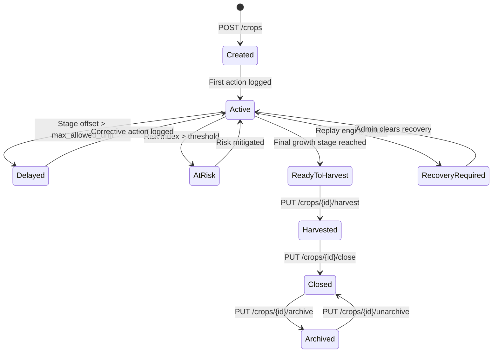

---

## 1.7 Service Request State Machine (Quick Reference)

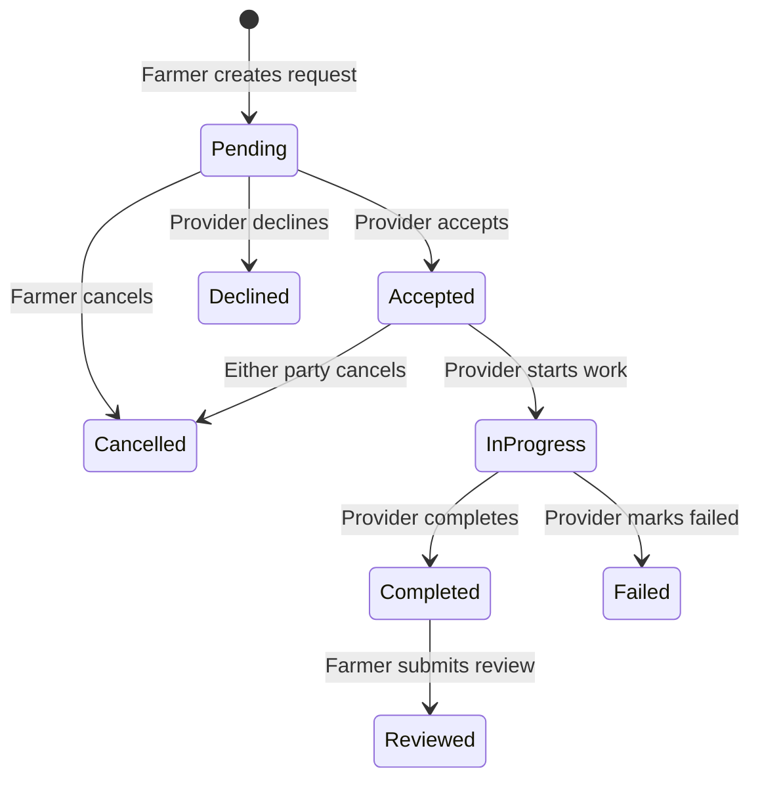

---

# PART 2 — DETAILED END-TO-END MANUAL

This section provides exhaustive, step-by-step instructions for every feature. Each feature includes: its purpose, the exact user actions, the expected API behavior, the fields involved, and an end-to-end workflow diagram.

---

## 2.1 Authentication System

### 2.1.1 Purpose
CultivaX implements a multi-layered authentication system with phone-based login (India context), OTP verification, brute-force protection, session management, and HttpOnly cookie-based JWT delivery (XSS-proof).

### 2.1.2 End-to-End Authentication Flow

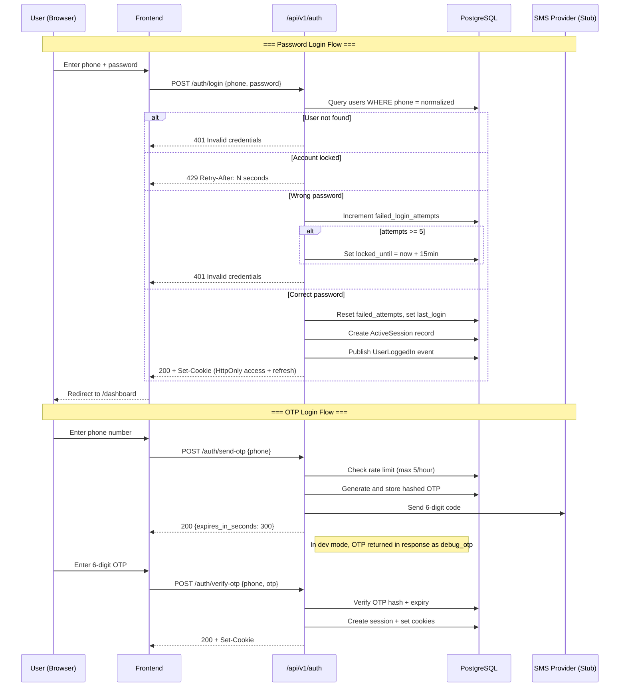

### 2.1.3 Registration

**Endpoint**: `POST /api/v1/auth/register`

**Required Fields**:

| Field | Type | Constraints | Example |
|-------|------|------------|---------|
| `full_name` | string | 1–200 chars | `"Rajesh Kumar"` |
| `phone` | string | Indian format | `"+919876543210"` |
| `password` | string | min 8 chars | `"password123"` |
| `role` | string | `farmer` or `provider` only | `"farmer"` |
| `region` | string | 1–100 chars | `"Punjab"` |

**Optional Fields**: `email`, `preferred_language` (default: `en`)

**Security Rules**:
- Admin accounts **cannot** be self-registered (blocked at API level)
- Phone numbers are normalized to E.164 format before storage
- Duplicate phone numbers return `409 Conflict`
- Passwords are hashed with **Argon2id** (not bcrypt)

**Step-by-step (Frontend)**:
1. Navigate to `http://localhost:3000/register`
2. Fill in Full Name, Phone Number, Password, select Role (Farmer/Provider), enter Region
3. Click **Register**
4. On success: you are automatically logged in and redirected to your dashboard

### 2.1.4 Password Login

**Endpoint**: `POST /api/v1/auth/login`

**Request Body**: `{ "phone": "+919876543210", "password": "password123" }`

**Step-by-step (Frontend)**:
1. Navigate to `http://localhost:3000/login`
2. Enter phone: `+919876543210`, password: `password123`
3. Click **Login**
4. On success: JWT access token + refresh token are set as HttpOnly cookies
5. You are redirected to `/dashboard`

**Error Scenarios**:
| Scenario | HTTP Code | Message |
|----------|-----------|---------|
| User not found | 401 | "Invalid phone number or password" |
| Wrong password | 401 | "Invalid phone number or password" |
| 5+ failed attempts | 429 | "Account locked... Try again in N seconds" |
| Account deactivated | 403 | "Account is deactivated. Contact admin." |

### 2.1.5 OTP Login

**Step 1** — Request OTP: `POST /api/v1/auth/send-otp` with `{ "phone": "+919876543210" }`
- Response: `{ "message": "OTP sent successfully", "expires_in_seconds": 300, "debug_otp": "123456" }`
- In development mode, the `debug_otp` field contains the actual OTP for testing

**Step 2** — Verify OTP: `POST /api/v1/auth/verify-otp` with `{ "phone": "+919876543210", "otp": "123456" }`
- On success: JWT cookies are set, user is logged in

**Rate Limits**: Max 5 OTP requests per phone per hour

### 2.1.6 Token Refresh

**Endpoint**: `POST /api/v1/auth/refresh`
- Reads the refresh token from the HttpOnly cookie
- Issues a new access + refresh token pair (token rotation)
- The old refresh token session is revoked
- If a revoked token is reused, **all sessions for that user are revoked** (replay attack protection)

### 2.1.7 Logout

**Endpoint**: `POST /api/v1/auth/logout`
- Revokes the current session
- Clears HttpOnly cookies
- Publishes a `UserLoggedOut` event

### 2.1.8 Session Management

**View sessions**: `GET /api/v1/auth/sessions` — returns all active sessions with device fingerprint, IP, and user agent

**Revoke all others**: `POST /api/v1/auth/sessions/revoke-all` — revokes every session except the current one

---

## 2.2 Crop Instance Lifecycle (CTIS Core)

### 2.2.1 Purpose
The CTIS is an event-sourced crop lifecycle manager. Every crop goes through a state machine (Created → Active → Harvested → Closed → Archived). All actions are logged as an append-only timeline, replayed via the ReplayEngine to compute stress scores, risk indices, and growth stages.

### 2.2.2 End-to-End Crop Lifecycle Flow

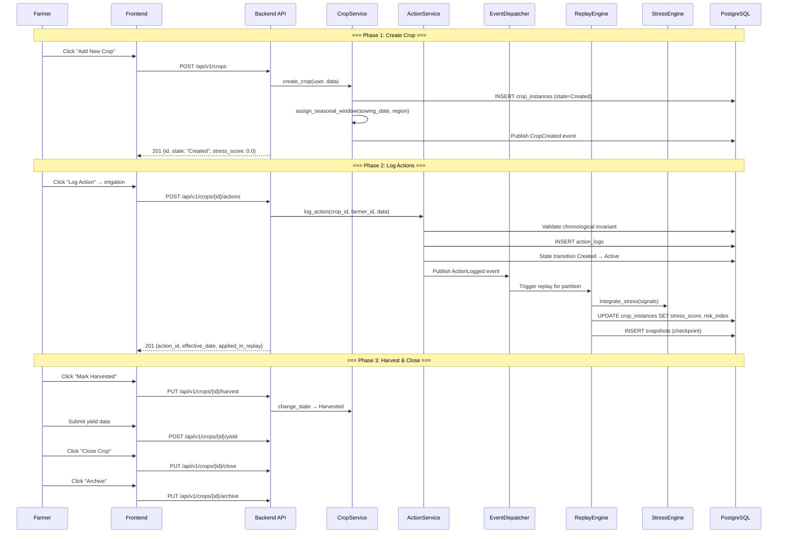

### 2.2.3 Creating a Crop Instance

**Endpoint**: `POST /api/v1/crops/`

**Required Fields**:

| Field | Type | Constraints | Example |
|-------|------|------------|---------|
| `crop_type` | string | 1–100 chars | `"wheat"` |
| `sowing_date` | date | ISO 8601 | `"2026-03-01"` |
| `region` | string | 1–100 chars | `"Punjab"` |

**Optional Fields**:

| Field | Type | Example |
|-------|------|---------|
| `variety` | string | `"HD-3226"` |
| `land_area` | float (> 0) | `5.5` (acres) |
| `sub_region` | string | `"Ludhiana"` |
| `land_parcel_id` | UUID | Link to a previously created land parcel |
| `rule_template_id` | UUID | Use a specific crop rule template |
| `metadata_extra` | JSON object | `{"soil_type": "loamy"}` |

**Step-by-step (Frontend)**:
1. Login as Farmer (`+919876543210`)
2. Navigate to `/crops` → **"My Crops"** page
3. Click **"Add New Crop"** button (redirects to `/crops/new`)
4. Fill in:
   - Crop Type: `wheat`
   - Sowing Date: pick a date **30+ days in the past** (so you can log actions)
   - Region: `Punjab`
   - (Optional) Variety, Land Area, Land Parcel
5. Click **"Create Crop"**
6. You are redirected to the crop detail page at `/crops/[id]`

**Response Fields**:

| Field | Description |
|-------|-------------|
| `id` | UUID of the created crop |
| `state` | `"Created"` (initial state) |
| `stage` | `null` (determined after first action) |
| `current_day_number` | `0` |
| `stress_score` | `0.0` |
| `risk_index` | `0.0` |
| `seasonal_window_category` | `"Early"`, `"Optimal"`, or `"Late"` — computed from sowing date and region |
| `stage_offset_days` | `0` (no drift yet) |
| `max_allowed_drift` | `7` (default: 7-day tolerance) |

### 2.2.4 Listing Crops

**Endpoint**: `GET /api/v1/crops/?page=1&per_page=20`

**Query Filters**:

| Parameter | Description | Example |
|-----------|-------------|---------|
| `state` | Filter by state | `state=Active` |
| `crop_type` | Filter by type | `crop_type=wheat` |
| `region` | Filter by region | `region=Punjab` |
| `include_archived` | Show archived crops | `include_archived=true` |
| `search` | Full-text search | `search=HD-3226` |
| `seasonal_window_category` | Filter by seasonal classification | `seasonal_window_category=Optimal` |

### 2.2.5 Updating a Crop

**Endpoint**: `PUT /api/v1/crops/{crop_id}`

**Updatable Fields**: `variety`, `land_area`, `land_parcel_id`, `sub_region`, `metadata_extra`

> **Note**: `crop_type`, `sowing_date`, `state`, `stress_score`, `risk_index` are **NOT** directly updatable. State changes go through the state machine. Sowing date has its own endpoint. Stress/risk are computed by the Replay Engine.

### 2.2.6 Modifying Sowing Date

**Endpoint**: `PUT /api/v1/crops/{crop_id}/sowing-date`

**Body**: `{ "new_sowing_date": "2026-02-15" }`

**What happens**: A full replay is triggered from scratch — the ReplayEngine recalculates all metrics using the new sowing date as the baseline.

### 2.2.7 Crop State Transitions

| Action | Endpoint | From State(s) | To State |
|--------|----------|---------------|----------|
| First action logged | (automatic) | Created | Active |
| Mark harvested | `PUT /crops/{id}/harvest` | Active, ReadyToHarvest | Harvested |
| Close crop | `PUT /crops/{id}/close` | Harvested | Closed |
| Archive | `PUT /crops/{id}/archive` | Closed | Archived |
| Unarchive | `PUT /crops/{id}/unarchive` | Archived | Closed |
| Admin clear recovery | `PATCH /crops/{id}/_admin/recovery/clear` | RecoveryRequired | Active |
| Admin retry replay | `PATCH /crops/{id}/_admin/recovery/retry` | Any | Active |

---

## 2.3 Action Logging & Chronological Invariant

### 2.3.1 Purpose
Every farmer action (irrigation, fertilizer, observation, pesticide, harvesting) is logged with a strict chronological invariant. Actions form the immutable timeline that the CTIS Replay Engine processes.

### 2.3.2 End-to-End Action Logging Flow

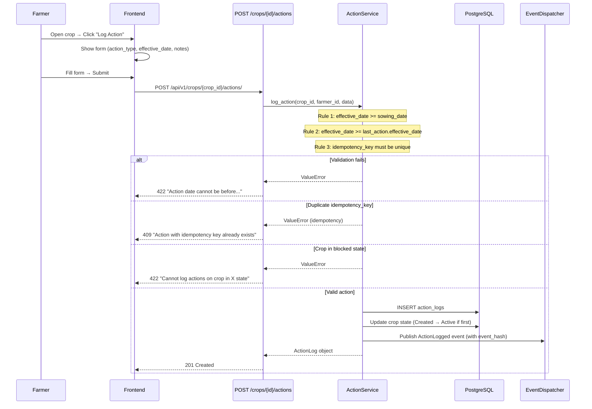

### 2.3.3 Logging an Action

**Endpoint**: `POST /api/v1/crops/{crop_id}/actions/`

**Required Fields**:

| Field | Type | Constraints | Example |
|-------|------|------------|---------|
| `action_type` | string | 1–100 chars | `"irrigation"`, `"fertilizer"`, `"observation"`, `"pesticide"`, `"harvesting"` |
| `effective_date` | date | Must be >= sowing_date AND >= last action date | `"2026-03-15"` |

**Optional Fields**:

| Field | Type | Default | Example |
|-------|------|---------|---------|
| `category` | string | `"Operational"` | `"Timeline-Critical"` or `"Corrective"` |
| `metadata_json` | JSON | `{}` | `{"weather_risk": 0.3, "amount_liters": 500}` |
| `notes` | string | null | `"Applied urea 50kg/acre"` |
| `local_seq_no` | int | null | `1` (for offline ordering) |
| `device_timestamp` | datetime | null | Offline device clock |
| `idempotency_key` | string | null | `"dedup-abc123"` (prevents duplicate submission) |

**Step-by-step (Frontend)**:
1. Navigate to `/crops/[id]` (your crop detail page)
2. Click **"Log Action"** (redirects to `/crops/[id]/log-action`)
3. Select Action Type from dropdown: `irrigation`
4. Pick Effective Date: must be on or after sowing date and on or after any previously logged action
5. (Optional) Add Notes: `"Applied 500 liters via drip system"`
6. (Optional) Add metadata as JSON
7. Click **"Submit Action"**
8. On success: redirected back to crop detail with updated timeline

**Response Format**:

| Field | Description |
|-------|-------------|
| `id` | UUID of the action |
| `crop_instance_id` | UUID of the parent crop |
| `action_type` | The type you submitted |
| `effective_date` | The date confirmed |
| `category` | Operational/Timeline-Critical/Corrective |
| `is_override` | Whether this overrides a recommended action |
| `applied_in_replay` | Status of replay processing |
| `server_timestamp` | When the server received the action |

### 2.3.4 Listing Actions

**Endpoint**: `GET /api/v1/crops/{crop_id}/actions/?page=1&page_size=20&sort=-effective_date`

**Sorting options**: `effective_date` (ascending) or `-effective_date` (descending, default)

---

## 2.4 Replay Engine, Snapshots, & Stress Scoring

### 2.4.1 Purpose
The Replay Engine is the computational backbone of CTIS. When an action is logged, it replays the entire action history through the Stress Engine to deterministically compute stress scores, risk indices, growth stages, and drift metrics. Snapshots checkpoint the state for fast recovery.

### 2.4.2 How Replay Works (Internal Flow)

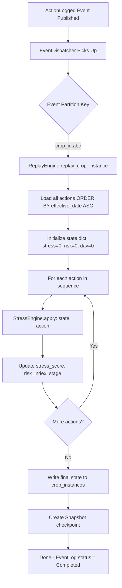

### 2.4.3 Viewing Replay Status

**Endpoint**: `GET /api/v1/crops/{crop_id}/replay/status`

**Response**:

| Field | Description |
|-------|-------------|
| `status` | `"idle"` or `"blocked"` (RecoveryRequired) |
| `last_replay_at` | Timestamp of last successful replay |
| `actions_replayed_since_last_snapshot` | How many new actions since last checkpoint |
| `recovery_required` | `true` if crop is in RecoveryRequired state |
| `recovery_reason` | Error message from Failed replay |
| `snapshot_count` | Total snapshots for this crop |
| `latest_snapshot_id` | UUID of the most recent snapshot |

### 2.4.4 Viewing Replay History

**Endpoint**: `GET /api/v1/crops/{crop_id}/replay/history?limit=50`

Returns all `ReplayTriggered`, `ReplayFailed`, and `RecoveryCleared` events for the crop.

### 2.4.5 Viewing Snapshots

**List**: `GET /api/v1/crops/{crop_id}/snapshots?page=1&page_size=20`

**Detail**: `GET /api/v1/crops/{crop_id}/snapshots/{snapshot_id}`

Each snapshot contains: `stress_score`, `risk_index`, `stage`, `chain_hash`, `action_index`.

---

## 2.5 What-If Simulation Engine

### 2.5.1 Purpose
The What-If engine lets farmers test hypothetical future actions without modifying live crop data. It replays the current state plus hypothetical actions in an isolated context.

### 2.5.2 End-to-End Simulation Flow

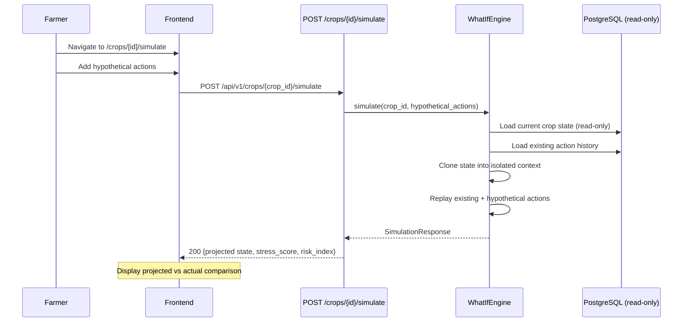

**Endpoint**: `POST /api/v1/crops/{crop_id}/simulate`

**Request Body**:
```json
{
  "hypothetical_actions": [
    {
      "action_type": "irrigation",
      "effective_date": "2026-04-20",
      "category": "Operational"
    },
    {
      "action_type": "fertilizer",
      "effective_date": "2026-04-25",
      "category": "Operational"
    }
  ]
}
```

**Step-by-step (Frontend)**:
1. Navigate to `/crops/[id]/simulate`
2. Click **"Add Hypothetical Action"** — add 1 or more future actions
3. Click **"Run Simulation"**
4. The engine will project the crop's stress_score, risk_index, and growth stage after these actions
5. No real data is modified

**Constraints**:
- Only the crop owner can simulate
- Cannot simulate a Closed or Archived crop (returns `409 Conflict`)

---

## 2.6 Yield Submission & Biological Cap

### 2.6.1 Purpose
After harvest, farmers submit their actual yield. The system computes a biological cap and yield verification score using ML heuristics.

**Endpoint**: `POST /api/v1/crops/{crop_id}/yield`

**Request Body**:
```json
{
  "reported_yield": 45.5,
  "yield_unit": "kg/acre",
  "harvest_date": "2026-04-10"
}
```

**Response Fields**:

| Field | Description |
|-------|-------------|
| `reported_yield` | What the farmer reported |
| `ml_yield_value` | ML-estimated yield for comparison |
| `biological_cap` | Maximum biologically plausible yield |
| `bio_cap_applied` | Whether the cap was enforced |
| `yield_verification_score` | 0.0–1.0 confidence score |

**Step-by-step**:
1. Navigate to `/crops/[id]/yield`
2. Enter reported yield (e.g., `45.5 kg/acre`)
3. Optionally set harvest date
4. Click **"Submit Yield"**
5. View the verification score and comparison with ML estimate

---

## 2.7 Service Marketplace (SOE)

### 2.7.1 Purpose
The Service Orchestration Engine connects farmers with service providers for equipment rental, labor hire, and agricultural services.

### 2.7.2 Full Service Request Lifecycle

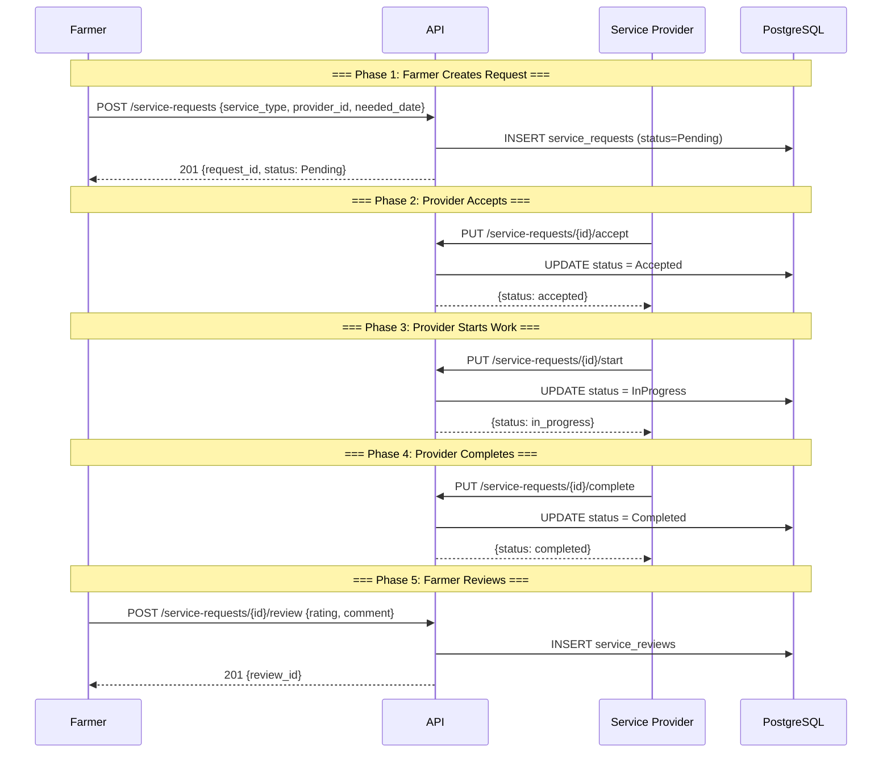

### 2.7.3 Creating a Service Request (Farmer)

**Endpoint**: `POST /api/v1/service-requests/`
**Role**: Farmer only

**Step-by-step**:
1. Login as Farmer
2. Navigate to `/services` → **"Service Marketplace"**
3. Browse available providers (GET `/api/v1/providers`)
4. Click on a provider to view their profile, equipment, ratings
5. Click **"Request Service"** (redirects to `/services/request`)
6. Fill in: service type, preferred date, description
7. Submit → status becomes `Pending`
8. View your requests at `/services/my-requests`

### 2.7.4 Accepting / Declining a Request (Provider)

**Accept**: `PUT /api/v1/service-requests/{id}/accept` — moves to `Accepted`
**Decline**: `PUT /api/v1/service-requests/{id}/decline` — moves to `Declined`

**Step-by-step**:
1. Login as Provider (`+919876543211`)
2. Navigate to `/provider` → **"Provider Dashboard"**
3. View incoming requests
4. Click **"Accept"** or **"Decline"**

### 2.7.5 Starting Work (Provider)

**Endpoint**: `PUT /api/v1/service-requests/{id}/start`

Moves the request from `Accepted` to `InProgress`.

### 2.7.6 Completing Work (Provider)

**Endpoint**: `PUT /api/v1/service-requests/{id}/complete`

Moves from `InProgress` to `Completed`.

### 2.7.7 Failing a Request (Provider)

**Endpoint**: `PUT /api/v1/service-requests/{id}/fail`

Marks the request as `Failed` (equipment broke down, weather prevented work, etc.).

### 2.7.8 Cancelling a Request

**Endpoint**: `PUT /api/v1/service-requests/{id}/cancel`

Both farmers and providers can cancel requests in `Pending` or `Accepted` state. Admins can cancel any request.

### 2.7.9 Reviewing a Completed Service (Farmer)

**Endpoint**: `POST /api/v1/service-requests/{id}/review`

**Body**: `{ "rating": 4, "comment": "Good service, arrived on time" }`

**Step-by-step**:
1. Login as Farmer
2. Go to `/services/my-requests`
3. Find a completed request
4. Click **"Write Review"**
5. Give a rating (1-5 stars) and optional comment
6. Submit

---

## 2.8 Provider Equipment & Labor Management

### 2.8.1 Equipment Management

**Endpoints** (Provider only):
- `POST /api/v1/providers/{provider_id}/equipment/` — Add equipment
- `GET /api/v1/providers/{provider_id}/equipment/` — List equipment
- `PATCH /api/v1/providers/{provider_id}/equipment/{id}` — Update
- `PATCH /api/v1/providers/{provider_id}/equipment/{id}/availability` — Toggle availability
- `DELETE /api/v1/providers/{provider_id}/equipment/{id}` — Remove

**Step-by-step**:
1. Login as Provider
2. Navigate to `/provider/equipment`
3. Click **"Add Equipment"**
4. Fill in: name, type, daily rate, description
5. Use the availability toggle to mark equipment as available/unavailable

### 2.8.2 Labor Management

**Endpoints**:
- `POST /api/v1/labor/` — Add labor listing
- `GET /api/v1/labor/` — List
- `PUT /api/v1/labor/{id}` — Update
- `PATCH /api/v1/labor/{id}/availability` — Toggle
- `DELETE /api/v1/labor/{id}` — Remove

---

## 2.9 In-App Messaging System

**Endpoints**:
- `GET /api/v1/messages/` — List conversations
- `POST /api/v1/messages/` — Send a message
- Various conversation management endpoints

**Step-by-step**:
1. Navigate to `/messages`
2. Select a existing conversation or start a new one
3. Type message and send
4. Messages are persisted with `is_read` tracking and `read_at` timestamps
5. Supports message types: `text`, `system`, `contact_share`

---

## 2.10 Weather & Risk Assessment

**Endpoints**:
- `GET /api/v1/weather/?region=Punjab` — Get weather risk for region
- `GET /api/v1/weather/risk?crop_id={id}` — Get crop-specific weather risk

**Step-by-step**:
1. Navigate to `/weather`
2. View weather conditions and risk levels for your region
3. Weather data integrates with the StressEngine to affect crop risk calculations

---

## 2.11 Government Schemes

**Endpoints**:
- `GET /api/v1/schemes/` — List available schemes
- `GET /api/v1/schemes/{id}` — Scheme detail
- `POST /api/v1/schemes/{id}/redirect` — Track click-through to official portal

**Step-by-step**:
1. Login as Farmer
2. Navigate to `/schemes`
3. Browse available government schemes relevant to your crop/region
4. Click on a scheme to view eligibility criteria and benefits
5. Click **"Apply on Official Portal"** — redirects to the government site, and the click-through is tracked

---

## 2.12 Alerts & Notifications

**Endpoints**:
- `GET /api/v1/alerts/` — List all alerts for current user
- `PUT /api/v1/alerts/{id}/acknowledge` — Mark alert as acknowledged
- `POST /api/v1/alerts/acknowledge-bulk` — Bulk acknowledge

**Alert Types**: `WeatherWarning`, `StressAlert`, `RiskThresholdBreached`, `GovernanceAction`, `SystemNotification`

**Severity Levels**: `info`, `warning`, `critical`

**Step-by-step**:
1. Navigate to `/alerts`
2. View all alerts sorted by urgency
3. Click **"Acknowledge"** to mark as read
4. Use **"Acknowledge All"** for bulk operation

---

## 2.13 Offline Sync (PWA)

### 2.13.1 Purpose
CultivaX supports fully offline operation via a PWA Service Worker. Actions logged while offline are queued locally and synced when connectivity is restored.

### 2.13.2 End-to-End Offline Sync Flow

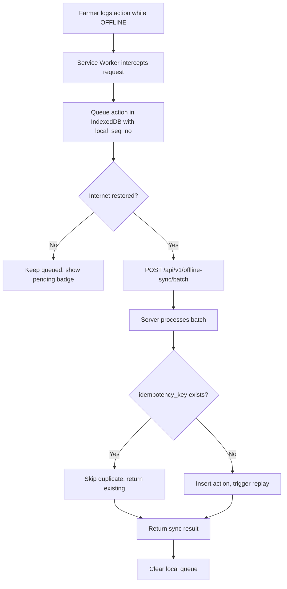

**Sync Endpoint**: `POST /api/v1/offline-sync/batch`

**Testing Steps**:
1. While on a crop's CTIS page, open DevTools → Network → toggle "Offline"
2. Log an action — the UI will accept it with a pending indicator
3. Turn "Offline" off
4. The action syncs automatically
5. Verify via `GET /api/v1/crops/{id}/actions/` that the action appears

---

## 2.14 Admin — User Governance

### 2.14.1 User Management

**Endpoints** (Admin only):
- `GET /api/v1/admin/users` — List all users
- `PUT /api/v1/admin/providers/{id}/suspend` — Suspend provider (requires reason)
- `PUT /api/v1/admin/providers/{id}/unsuspend` — Unsuspend

**Step-by-step**:
1. Login as Admin (`+919876543212`)
2. Navigate to `/admin/users`
3. View all registered users with their roles, regions, and status
4. To suspend a provider: Navigate to `/admin/providers`, select a provider, click **"Suspend"**, enter justification
5. The system creates an audit log entry and sends an alert to the provider

### 2.14.2 Provider Suspension Rules

| Action | Requires Reason | Audit Logged | Alert Sent |
|--------|----------------|-------------|------------|
| Suspend | ✅ Yes (mandatory) | ✅ Yes | ✅ Critical alert to provider |
| Unsuspend | ✅ Yes (mandatory) | ✅ Yes | ✅ Info alert to provider |

---

## 2.15 Admin — Dead Letter Queue (DLQ) Management

### 2.15.1 Purpose
Failed events that exhaust all retry attempts are moved to the Dead Letter Queue. The admin can inspect, retry, or discard them.

### 2.15.2 Dead Letter Management Flow

```mermaid
flowchart TD
    A[Event fails processing] --> B{retry_count < max_retries?}
    B -->|Yes| C[Exponential backoff retry]
    B -->|No| D[Move to DeadLetter status]
    D --> E[Admin views /admin/dead-letters]
    E --> F{Admin action}
    F -->|Retry Single| G[POST /admin/dead-letters/{id}/retry]
    F -->|Bulk Retry| H[POST /admin/dead-letters/bulk-retry]
    F -->|Discard| I[DELETE /admin/dead-letters/{id}]
    G --> J[Reset to Created, retry_count = 0]
    H --> J
    I --> K[Soft delete event]
```

**Endpoints**:
- `GET /api/v1/admin/dead-letters?page=1&per_page=50&event_type=ActionLogged` — List with filters
- `POST /api/v1/admin/dead-letters/{event_id}/retry` — Retry single
- `POST /api/v1/admin/dead-letters/bulk-retry` — Bulk retry with filters
- `DELETE /api/v1/admin/dead-letters/{event_id}` — Discard permanently

**Bulk Retry Request**:
```json
{
  "event_type": "ActionLogged",
  "older_than_minutes": 60,
  "limit": 100,
  "reason": "Transient database error resolved"
}
```

**Step-by-step**:
1. Navigate to `/admin/dead-letters`
2. View failed events with their error messages, retry counts, and timestamps
3. Click **"Retry"** on individual events or use **"Bulk Retry"** with filters
4. All retry operations are audit-logged with the admin's identity

---

## 2.16 Admin — Audit Trail

**Endpoint**: `GET /api/v1/admin/audit?page=1&per_page=20&action=provider_suspended`

**Filters**: `action`, `admin_id`, `entity_type`, `date_from`, `date_to`

Every admin action (suspend, unsuspend, retry, discard, flag review, rule change) is immutably logged in the `admin_audit_log` table with before/after values and justification reasons.

**Step-by-step**:
1. Navigate to `/admin/audit`
2. Browse all admin actions with timestamps and reasons
3. Filter by action type, admin, or date range

---

## 2.17 Admin — ML Model Management

**Endpoints**:
- `GET /api/v1/ml/models` — List registered ML models
- `GET /api/v1/ml/feedback` — View farmer feedback on predictions
- `GET /api/v1/ml/inference-audits` — Audit inference decisions
- `GET /api/v1/ml/training-audits` — Audit training runs

**Step-by-step**:
1. Navigate to `/admin/ml-models`
2. View all registered models with their versions and status
3. Check feedback aggregation to see how farmers rate the ML predictions
4. View inference audit trail to see what predictions were made and why

---

## 2.18 Admin — Crop Rules Engine

**Endpoints**:
- `GET /api/v1/rules/` — List all crop rule templates
- `POST /api/v1/rules/` — Create new rule (Admin only)
- Various rule management endpoints

**Step-by-step**:
1. Navigate to `/admin/rules`
2. View crop rule templates that define growth stages, recommended actions, and penalties
3. Create or modify rules — changes are version-tracked

---

## 2.19 Admin — Abuse Flag Pipeline

**Endpoints**:
- `GET /api/v1/admin/abuse-flags?status=open` — List flags
- `GET /api/v1/admin/abuse-flags/{id}` — Flag detail
- `PATCH /api/v1/admin/abuse-flags/{id}/review?new_status=actioned` — Review

**Step-by-step**:
1. Navigate to admin dashboard
2. View flagged accounts with severity scores and anomaly details
3. Review and action flags: `reviewed`, `dismissed`, or `actioned`

---

## 2.20 Admin — System Health & Maintenance

**Health**: `GET /api/v1/admin/health` — Full subsystem health with latency probes

**Maintenance Status**: `GET /api/v1/admin/maintenance/status` — Cron job status, last runs, overdue flags

**Trigger Maintenance**: `POST /api/v1/admin/maintenance/run?cadence=hourly&force=true` — Manually trigger cron jobs during demo

**Force Replay**: `POST /api/v1/admin/crops/{crop_id}/force-replay` — Queue immediate replay for a specific crop

**Step-by-step**:
1. Navigate to `/admin/health` — view all subsystem statuses
2. Navigate to `/admin/maintenance` — view cron job schedule
3. Click **"Run Now"** to manually trigger the hourly/daily/weekly maintenance

---

## 2.21 Analytics & Reporting

**Endpoints**:
- `GET /api/v1/analytics/overview` — Platform overview stats
- `GET /api/v1/analytics/crops/distribution` — Crop type distribution
- `GET /api/v1/analytics/regions/demand` — Regional demand analysis
- `GET /api/v1/analytics/admin-stats` — Admin-level statistics
- `GET /api/v1/dashboard/stats` — Farmer dashboard stats
- `GET /api/v1/dashboard/activity` — Recent activity feed

---

## 2.22 Search

**Endpoint**: `GET /api/v1/search/?q=wheat&page=1&per_page=20`

Full-text search across crops, providers, equipment, and services. Returns ranked results with relevance scores.

---

## 2.23 Account Management & Data Privacy

**Endpoints**:
- `GET /api/v1/account/me` — View account details
- `GET /api/v1/account/me/export` — Export all personal data (GDPR-style)
- `POST /api/v1/account/me/delete` — Request account deletion
- `GET /api/v1/consent/purposes` — View consent purposes
- `POST /api/v1/consent/me/{purpose}` — Grant consent
- `DELETE /api/v1/consent/me/{purpose}` — Revoke consent

**Data Export**: `GET /api/v1/admin/farmers/{farmer_id}/export` (Admin) — Export all farmer data as JSON including crops, actions, media, and alerts

---

## 2.24 Internationalization (i18n)

**Endpoint**: `GET /api/v1/translations/{locale}` — Get translation strings

**Supported Languages**: `en` (English), `hi` (Hindi), `ta` (Tamil), `te` (Telugu), `mr` (Marathi)

**Step-by-step**:
1. Navigate to Settings
2. Change preferred language
3. The entire UI switches to the selected language

---

## 2.25 Complete System End-to-End Flow

This diagram shows the complete lifecycle of a farmer using CultivaX from registration through crop completion.

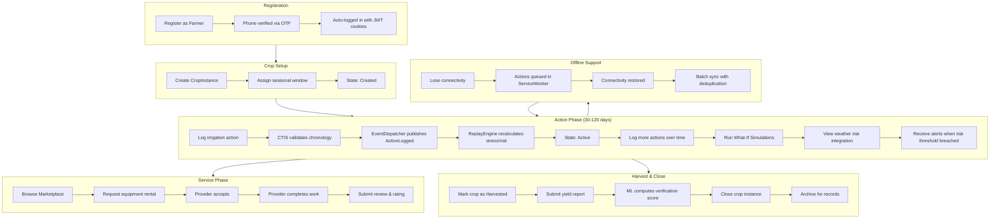

---

# APPENDIX A — Known Limitations & Demo Constraints

| # | Feature | Limitation | Workaround |
|---|---------|-----------|------------|
| 1 | **SMS / OTP Delivery** | SMS gateways (Twilio) are fully mocked. OTPs are not actually sent via SMS. | In development mode, the OTP is returned in the API response as `debug_otp`. Also printed to backend console logs: `docker compose logs backend` |
| 2 | **ML Inference** | Deep learning models (CNN for stress detection, risk prediction) operate as static heuristic matrices. No live TensorFlow/PyTorch execution. | Risk scores and stress values are computed deterministically from the action timeline using the StressEngine's formula-based integration |
| 3 | **Weather Data** | Weather risk values are generated from internal rule-based calculations, not from live meteorological APIs (e.g., OpenWeather). | The `weather_risk` field in action metadata allows manual injection of weather signals for testing |
| 4 | **Geospatial Mapping** | Land parcels use simple lat/lng coordinates. No PostGIS polygon topology or satellite imagery overlay. | Basic map views are rendered via Google Maps embeds |
| 5 | **Cron Jobs** | Background scheduled tasks (trust decay, listing reconfirmation, stale data cleanup) run on 6–24 hour intervals. | Admin can manually trigger any cron cadence via `POST /api/v1/admin/maintenance/run?cadence=hourly&force=true` |
| 6 | **Media Analysis** | Image upload and analysis pipeline is stubbed. No actual computer vision processing. | Upload endpoints accept files and store metadata, but the analysis_status remains in the pending state |
| 7 | **WhatsApp Integration** | WhatsApp webhook endpoint exists but is not connected to a live WhatsApp Business API. | The endpoint validates webhook signatures correctly but operates in pass-through mode |
| 8 | **Payment Processing** | No payment gateway integration. Service requests do not involve monetary transactions. | Pricing is tracked as metadata but no payment flow is executed |
| 9 | **Push Notifications** | Browser push notifications are not implemented. All notifications are in-app alerts only. | Use the `/alerts` page to view all notifications |
| 10 | **Email Delivery** | No email provider configured. Email-based features (password reset via email) are not operational. | Use phone + OTP or password login instead |

---

# APPENDIX B — API Reference Summary

**Base URL**: `http://localhost:8000/api/v1`

**Interactive Documentation**: `http://localhost:8000/docs` (Swagger UI) or `http://localhost:8000/redoc` (ReDoc)

| Method | Endpoint | Auth | Role | Description |
|--------|----------|------|------|-------------|
| POST | `/auth/register` | No | — | Create account |
| POST | `/auth/login` | No | — | Password login |
| POST | `/auth/send-otp` | No | — | Request OTP |
| POST | `/auth/verify-otp` | No | — | Verify OTP + login |
| POST | `/auth/refresh` | Cookie | — | Rotate tokens |
| POST | `/auth/logout` | Cookie | — | End session |
| GET | `/auth/me` | Yes | — | Current user info |
| GET | `/auth/sessions` | Yes | — | List active sessions |
| POST | `/auth/sessions/revoke-all` | Yes | — | Revoke all other sessions |
| POST | `/crops/` | Yes | Farmer | Create crop |
| GET | `/crops/` | Yes | Farmer | List crops |
| GET | `/crops/{id}` | Yes | Farmer | Get crop detail |
| PUT | `/crops/{id}` | Yes | Farmer | Update crop |
| PUT | `/crops/{id}/sowing-date` | Yes | Farmer | Modify sowing date (triggers replay) |
| PUT | `/crops/{id}/activate` | Yes | Farmer | Transition to Active |
| PUT | `/crops/{id}/harvest` | Yes | Farmer | Transition to Harvested |
| PUT | `/crops/{id}/close` | Yes | Farmer | Transition to Closed |
| PUT | `/crops/{id}/archive` | Yes | Farmer | Archive crop |
| PUT | `/crops/{id}/unarchive` | Yes | Farmer | Unarchive crop |
| POST | `/crops/{id}/actions/` | Yes | Farmer | Log action |
| GET | `/crops/{id}/actions/` | Yes | Farmer | List actions |
| POST | `/crops/{id}/simulate` | Yes | Farmer | What-if simulation |
| POST | `/crops/{id}/yield` | Yes | Farmer | Submit yield |
| GET | `/crops/{id}/replay/status` | Yes | Farmer | Replay status |
| GET | `/crops/{id}/replay/history` | Yes | Farmer | Replay event log |
| GET | `/crops/{id}/snapshots` | Yes | Farmer | List snapshots |
| POST | `/service-requests/` | Yes | Farmer | Create request |
| GET | `/service-requests/` | Yes | All | List requests |
| PUT | `/service-requests/{id}/accept` | Yes | Provider | Accept |
| PUT | `/service-requests/{id}/start` | Yes | Provider | Start work |
| PUT | `/service-requests/{id}/complete` | Yes | Provider | Complete |
| PUT | `/service-requests/{id}/decline` | Yes | Provider | Decline |
| PUT | `/service-requests/{id}/cancel` | Yes | All | Cancel |
| PUT | `/service-requests/{id}/fail` | Yes | Provider | Mark failed |
| POST | `/service-requests/{id}/review` | Yes | Farmer | Submit review |
| GET | `/providers/` | Yes | All | List providers |
| GET | `/providers/{id}` | Yes | All | Provider detail |
| GET | `/admin/dead-letters` | Yes | Admin | List dead letters |
| POST | `/admin/dead-letters/{id}/retry` | Yes | Admin | Retry single |
| POST | `/admin/dead-letters/bulk-retry` | Yes | Admin | Bulk retry |
| DELETE | `/admin/dead-letters/{id}` | Yes | Admin | Discard |
| GET | `/admin/audit` | Yes | Admin | Audit trail |
| GET | `/admin/health` | Yes | Admin | System health |
| POST | `/admin/maintenance/run` | Yes | Admin | Trigger cron |
| GET | `/admin/abuse-flags` | Yes | Admin | Abuse flags |
| GET | `/alerts/` | Yes | All | My alerts |
| PUT | `/alerts/{id}/acknowledge` | Yes | All | Acknowledge |
| GET | `/weather/` | Yes | Farmer | Weather data |
| GET | `/schemes/` | Yes | Farmer | Gov schemes |
| GET | `/ml/models` | Yes | Admin | ML models |
| GET | `/search/?q=...` | Yes | All | Full-text search |
| GET | `/translations/{locale}` | No | — | i18n strings |

---

# APPENDIX C — Test Execution

To verify the system passes all automated tests:

```bash
cd backend
source venv/bin/activate
pytest -q --tb=short
```

**Expected Result**: `458 passed, 20 skipped, 0 failed`

The 20 skipped tests are async coroutine tests that require `pytest-asyncio` and are intentionally skipped in the synchronous test runner.
